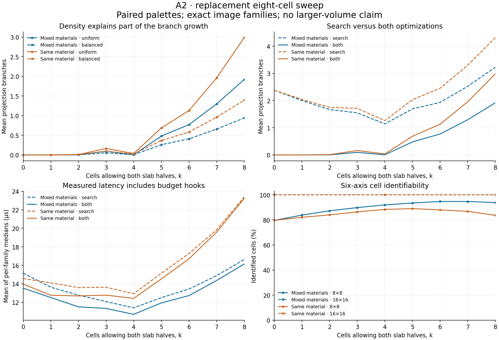

# A2: fixed eight-cell scaling checkpoint

This is a **replacement collection after failed workspace recovery**, using the
accepted solver at `e73b710a42bca1cd0c7a69b9b9c37db2595a1cb1`. The interrupted
run's source, masks, seeds, measurements, and analysis were not accessible from
this branch. Its reported 410,953 cases are not the dataset published here.
The [recovery record](a2-scaling-recovery.md) explains what survived and what was
reconstructed. No accepted solver, frozen reference, or correctness evidence
changed, and no full correctness/sanitizer gate or larger-volume experiment ran.

## Population and measurement

The grid remains 2 x 2 x 2. At k selected cells, domains allow air, oak bottom
slab, and a top slab; the other cells allow only air or oak bottom slab. Top
slabs are stone in `split` and oak in `same`. The palettes share every placement,
truth geometry, camera, restriction seed, and solver setting. This controls the
additional visibility information supplied by material labels.

There are 30 masks: the unique masks at k=0 and k=8, and four at each intervening
k. Each placement enumerates all `3^k * 2^(8-k)` legal truth worlds. Observations
are grouped into complete image families. The six suites are axis 1, 2, 3, 6,
and one/two oblique cameras from the established rig. Every mask uses 8 x 8
sampling. All six placements at k=0,4,8 also use 16 x 16 sampling. These are
explicit replacement choices; the unavailable original mask/sampling manifest
cannot be inferred from its aggregate case count.

The [protocol](../results/a2-scaling-8cell/protocol.json) was saved before
collection and includes every mask and job, literal seeds, ordering, perturbation
rules, query sampling, repetitions, and budgets. There are 72 camera jobs and
two structured-control jobs. Each camera job adds eight seeded
restriction/observation cases per suite. The structured controls reuse the
physical path and triangle and the existing abstract two-path, path-plus-triangle,
fixed-hit, and fixed-hit-plus-path cases, with unused cells fixed to air.

All four existing settings retain GAC: `search`, `decomposition`, `fixed_hit`,
and `both`. Feasibility and full supported-domain projection are timed separately
three times per family/mode. The mode order rotates with case and repetition;
palette order alternates across placements. Every 97th camera family and all
additional cases receive all 24 direct literal queries, once per mode. No solver
jobs run concurrently. Oracle construction, witness verification, root graph
measurement, and output are outside each timed API call.

Each call has a budget of 1,000,000 search-node entries or 60 seconds. Observer
checks and a post-return deadline check map exhaustion to **UNRESOLVED**. The
node statistic can include the extra attempted entry at which the observer
aborts, before that node propagates. A contradiction established at the root of
projection may legitimately use zero search entries. Zero-time, zero-node, and
root-contradiction boundary checks passed. Budget observer and diagnostics costs
are included in reported latency; these are not uninstrumented solver timings.

## Completed coverage and integrity

| Saved quantity | Count |
| --- | ---: |
| Distinct camera families across declared strata | 487,731 |
| Restricted/perturbed cases | 3,456 |
| Structured cases | 12 |
| **Total cases** | **491,199** |
| Camera truth/placement/suite/palette memberships | 818,808 |
| Case/configuration combinations | 1,964,796 |
| Timed feasibility and projection calls, including repeats | 11,788,776 |
| Timed direct support queries | 836,064 |
| **Total timed calls** | **12,624,840** |
| Independently checked witness returns, including repeats | 13,962,316 |
| **Unresolved calls / semantic disagreements** | **0 / 0** |

The 8 x 8 jobs contain 377,651 cases, the 16 x 16 jobs 113,536, and the two
structured jobs 12. These counts overlap the accepted tiny model and are not
additional unique worlds. The collection, including enumeration, validation,
and compression, took about 227 seconds on the recorded host.

Both palettes and all four modes matched the independent AABB/exhaustive
families on feasibility and exact masks. Every returned witness was checked
against its family and original domains, and independently against the ray
constraints. Projection witnesses collectively cover exactly the supported
literals. Direct queries include excluded states. Repeated calls have identical
work counters. The 8 x 8 rendering reuses the surviving, hash-verified frozen
Python images; the 16 x 16 controls compare independent AABB and traversal
rendering. Reference families are never passed to the solver.

The targeted frozen-Python comparison passed **876 cases, 21,024 literal
queries, 5,563 Python witness checks, and 94,134 audited prunes**. It uses the
accepted adapter guard for empty domains: 6,364 calls were rejected before
entering the frozen solver. The previously documented out-of-ray empty-domain
limitation remains a reference limitation; the frozen file is unchanged. This
spot check is separate from the full accepted correctness gate and does not
claim to repeat it.

Outputs were closed in memory-backed storage and validated before publication.
Checks include complete family probability mass for every stratum, all expected
case/API keys, row counts, statuses, repeat consistency, witness totals, and
compressed/uncompressed SHA-256. Every job has a completion manifest; partial
jobs cannot masquerade as complete ones.

For efficient transport, all 148 raw CSV tables are stored losslessly as typed
columns, with exact CSV-byte reconstruction checked against the original hashes.
The split archive also includes all job manifests, logs, and Python spot inputs.
Its parts and complete tar stream have SHA-256 checks. The unpacker restores the
original CSV gzip files and verifies their original hashes. No trial, family,
query, timing sample, or work counter is discarded.

A later workspace reread found six truncated temporary unpacked copies. All
original measurement shards and transport parts remained hash-correct. Those
temporary copies were repaired without rerunning measurements, and archive
bytes read from the Git index were checked against the manifest. Exact affected
filenames and sizes are recorded in `validation.json`.

## Results and weighting

The main summaries keep three different averages separate. Each first weights
families within one placement/suite, then gives placements and suites equal
weight at fixed k:

- **Truth:** family size is its weight, equivalent to a uniform legal truth.
- **Family:** each distinct image family gets one vote. This is a different
  population in the two palettes because equal materials merge images.
- **Occupancy-balanced:** a secondary reweighting sets independent occupancy
  to 1/2 at every cell and chooses each slab half with probability 1/2 conditional
  on occupancy at incomparable cells. It changes no observations or solver calls.

Uniform legal truths raise expected occupancy from 4 cells at k=0 to 5 1/3 at
k=8. The balanced average holds expected occupancy at 4. For a family, the exact
balanced numerator is the sum of `2^(k - occupied_incomparable_cells)` across
its truths, with denominator `2^(8+k)`. The saved masses sum to that denominator
for every camera stratum.

Mean full-projection branches at **k=8, 8 x 8**, with both optimizations:

| Palette | Uniform truth | Distinct family | Occupancy-balanced |
| --- | ---: | ---: | ---: |
| Mixed material | 1.919753 | 1.691413 | 0.940908 |
| Same material | 2.986105 | 2.029430 | 1.392619 |

The growth survives occupancy balancing, but k alone does not predict work.
The selected k=4 placements have less search than k=3; visibility, spatial
arrangement, and residual constraints matter. Equal materials can remove useful
label information even when the legal shape population is identical.

Across the **374,771 camera families at 8 x 8**, counting each family once and
summing across strata, projection branch totals are:

| Setting | Branches | Sum of per-family median latency |
| --- | ---: | ---: |
| Search | 97,453 | 3.963700 s |
| Decomposition | 97,453 | 3.951813 s |
| Fixed-hit | 47,739 | 3.946784 s |
| Both | 47,883 | 3.952743 s |

Thus fixed-hit removes **51.0%** of these branches; both removes **50.9%**.
The corresponding latency differences are only about **0.43%** and **0.28%**.
These totals give one vote to each saved family across all strata, unlike the
equal-placement/suite averages above. The latter, additionally averaging k and
palette equally, give about 70.7% fewer branches and 5.1% lower measured latency
for both versus search. The weighting changes the conclusion's magnitude.
Neither calculation establishes a reliable general runtime speedup: timings
are short, observer costs are included, and this is one host/run with three
interleaved trials, no dedicated CPU isolation, and no independent run replicates.

The compiler was GCC 13.3.0 with `-std=c++20 -O3 -DNDEBUG`; the host reports
AMD EPYC 9V74. At k=8, truth-weighted projection latency with both options is
16.14 microseconds for mixed materials and 23.24 microseconds for the control.
These are means of per-family medians across the six suites. Full within-stratum
median, p95, maximum, and all individual trials are saved. Whole-process peak
RSS is recorded per job and includes exhaustive/reference data; it is not
solver-only memory.

Decomposition alone saves no camera-corpus branches. It can add component-entry
nodes, while changing witness reuse can slightly increase projection work with
both options compared with fixed-hit alone. Its targeted benefit remains clear:

| Feasibility control, both palettes | Search branches | Both branches |
| --- | ---: | ---: |
| Fixed-hit ray | 1 | 0 |
| Two satisfiable paths | 4 | 4 |
| Path plus independent triangle | 9 | 5 |
| Fixed-hit region plus path | 3 | 2 |

The physical path still has two worlds, three unsupported air values after GAC,
and feasibility work of 3 nodes / 2 branches. The physical triangle still has
no worlds despite nonempty local GAC domains, with 4 nodes / 3 branches.

At 8 x 8, maximum camera feasibility work is 9 nodes / 8 branches without
decomposition and 13 / 8 with it. Projection reaches 45 / 32 or 61 / 32.
The worst optimized projection is the k=8 one-axis family represented by truth
ID 3320: 16 feasible worlds, four residual components of two cells each, and
32 aggregate projection branches. This is work across several conditioned
queries, not 32 branches in one irreducible eight-cell component. Root component
sizes are measured before timing; they bound descendant component sizes because
conditioning only removes the recorded dependencies, but are not a search trace.

All tested **16 x 16 six-axis** families at k=0,4,8 are singletons and use zero
branches in every mode. At k=8 and 8 x 8, six-axis cell identifiability is 93.87%
for mixed materials and 83.63% for the same-material control. Sampling resolution
and material information therefore strongly affect the observed ambiguity.



## Reproduction and limits

To inspect/reanalyze the existing dataset without running any solver:

```bash
python experiments/pack_a2_scaling.py unpack results/a2-scaling-8cell/raw build/a2-scaling-restored
python experiments/analyze_a2_scaling.py build/a2-scaling-restored build/a2-scaling-analysis
python experiments/check_a2_scaling_python.py build/a2-scaling-restored build/a2-scaling-python.json
```

NumPy, pandas, and Matplotlib are used by the packaging/analysis scripts. The
Python spot check uses NumPy and the frozen file already in this repository.
To reproduce measurement intentionally, use `bash experiments/build_a2_scaling.sh`
or the CMake `mcr_a2_scaling` target, then `python experiments/run_a2_scaling.py
--output build/a2-scaling-raw`. The driver verifies existing complete jobs before
reusing them. The documented accepted image fixtures are expected at
`build/oracle_a2`; the existing oracle exporter can create them on a new machine.
No existing result should be overwritten to disguise a different compiler,
protocol, or executable: provenance mismatches stop resumption.

This checkpoint is about a fixed eight-cell controlled model, not volume
scalability. It establishes neither polynomial behavior for arbitrary A2 scenes
nor exponential lower bounds. Four masks per intermediate k are not every mask;
the finite perturbations are not every restriction or contradictory observation.
The model assumes known exact cameras/grid, opaque first-hit labels, exact
synthetic rendering, and no model mismatch. Marginal supported states do not
form a Cartesian family of solutions; complete freedom is separately checked
by substitution within the entire feasible family. These observations do not
extend to lighting, textures, transparency, unknown cameras, or real screenshots.

The original interrupted measurements remain unavailable. The published protocol
and raw data make this replacement independently inspectable. Larger-volume
scaling remains unstarted.
